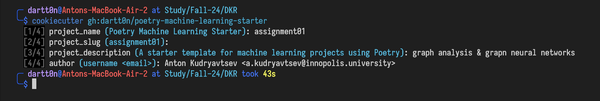
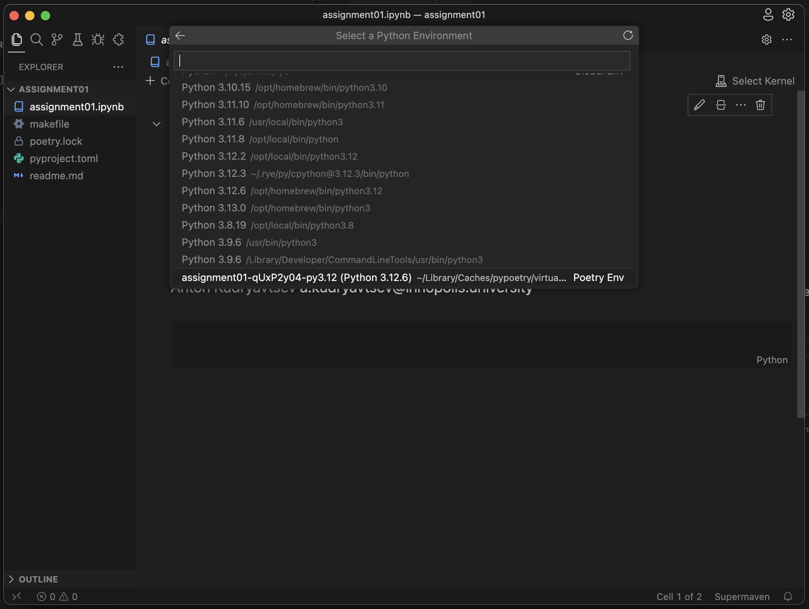

# Poetry Machine Learning Starter

This is a template for machine learning projects using [Poetry](https://python-poetry.org).

## Getting Started

1. Install [pipx](https://pypa.github.io/pipx) and/or [cookiecutter](https://cookiecutter.readthedocs.io/en/stable/installation.html)

2. Install [poetry](https://python-poetry.org/docs/#installation)

3. Create new project using cookiecutter
```bash
cookiecutter gh:dartt0n/poetry-machine-learning-starter
```
or with pipx
```bash
pipx run cookiecutter gh:dartt0n/poetry-machine-learning-starter
```

4. Fill out the prompts


5. Setup environment
```bash
cd <new project>
make install # or run `poetry install`
```

6. 🎉 Ready to go! 🎉


## What's Included

### Jupyter Notebook Support
- [ipython](https://ipython.readthedocs.io/en/stable/index.html)
- [ipykernel](https://ipython.readthedocs.io/en/stable/install/kernel_install.html)
- [ipywidgets](https://ipywidgets.readthedocs.io/en/latest/index.html)
- [jupyter notebook](https://jupyter.org)
- [jupyterlab](https://jupyterlab.readthedocs.io/en/stable/index.html)
### Visualization
- [matplotlib](https://matplotlib.org/stable/)
- [seaborn](https://seaborn.pydata.org)
- [plotly](https://plotly.com/python/)
### Machine Learning
- [scikit-learn](https://scikit-learn.org/stable/)
- [torch](https://pytorch.org)
- [lightning](https://lightning.ai)
- [opencv-python](https://pypi.org/project/opencv-python/)
- [onnx](https://onnx.ai)
### Monitoring
- [wandb](https://wandb.ai)
- [tensorboard](https://www.tensorflow.org/tensorboard)
- [clearml](https://clear.ml)
### User Interfaces
- [streamlit](https://streamlit.io)
- [gradio](https://gradio.app)
### Development & Misc
- [ruff](https://github.com/charliermarsh/ruff)
- [cattrs](https://cattrs.readthedocs.io/en/stable/)

## How to use?

### Select kernel
Poetry creates a brand new virtual environment for each project. To use the virtual environment created for this project, select the kernel with name similar to your project name. It should be automatically detected by VSCode and PyCharm and marked as `poetry env`.



### Format code (yes, jupyter notebooks too!)
```bash
make format
```
or
```bash
poetry run ruff format .
```

### Lint code (yes, jupyter notebooks too!)
```bash
make lint
```
or
```bash
poetry run ruff check .
```

### Add dependencies
```bash
poetry add <package> # instead of `pip install <package>`
```

### Why not just use `pip install`?

- Poetry creates a virtual environment for each project, so you don't have to worry about conflicts between packages.
- Poetry creates a lockfile, so you can be sure that the exact versions of the packages you use are the ones that are used in the project.
- Poetry creates a virtual environment for each project, so you can be sure that the exact versions of the packages you use are the ones that are used in the project.
- Poetry automatically install compatible versions of packages, so you don't have to manually match the versions of the packages you use.

Read more why `poetry` is much better than `pip` in the internet. `poetry` is a standard for modern Python projects, and it's a great way to manage dependencies.